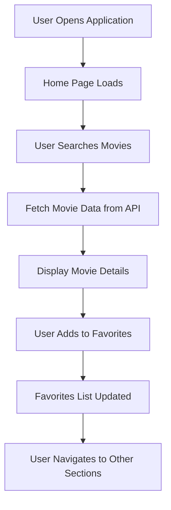

# 🎥 MovieApp

MovieApp is an Angular-based application designed to showcase movies, with features such as a user-friendly interface, dynamic components, and seamless integration with the Angular CLI. This project leverages Angular CLI (version 1.0.3) for rapid development and efficient code management.

---

## 🚀 Development Server

- Start the development server with:
  ```bash
  ng serve
  ```
- Navigate to: [http://localhost:4200/](http://localhost:4200/)  
  The app automatically reloads when you make changes to the source files.

---

## 🛠️ Code Scaffolding

- Generate a new component:
  ```bash
  ng generate component component-name
  ```
- You can also generate other Angular constructs such as directives, pipes, services, classes, or modules:
  ```bash
  ng generate directive|pipe|service|class|module
  ```

---

## 📦 Build

- Build the project for development:
  ```bash
  ng build
  ```
- Build the project for production:
  ```bash
  ng build --prod
  ```
- The build artifacts will be stored in the `dist/` directory.

---

## ✅ Running Unit Tests

- Execute unit tests using Karma:
  ```bash
  ng test
  ```

---

## 🧹 Linting Code

- Lint TypeScript code:
  ```bash
  ng lint
  ```

---

## 🔍 Running End-to-End Tests

- Run e2e tests using Protractor:
  ```bash
  ng e2e
  ```
- Ensure the app is running via `ng serve` before executing the tests.

---

## 📊 Application Flow



---

## ℹ️ Further Assistance

For more guidance on Angular CLI commands:
- Run:
  ```bash
  ng help
  ```
- Visit the [Angular CLI README](https://github.com/angular/angular-cli/blob/master/README.md).

---


## ✨ Acknowledgments

Special thanks to the Angular community for their continuous support and tools that empower developers worldwide.
